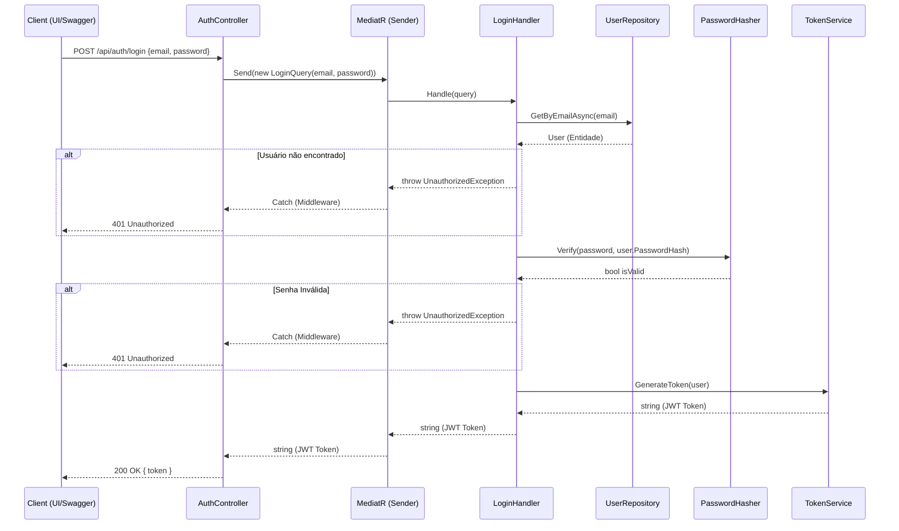

# Design Técnico - Autenticação e Login JWT

## 1. Arquitetura da Solução
Seguindo os princípios de *Clean Architecture* e CQRS (*MediatR*), o fluxo de Autenticação foi projetado da seguinte maneira:
- **API (Apresentação):** `AuthController` recebe a requisição HTTP POST e delega o processamento despachando uma query (`LoginQuery`).
- **Application (Regras de Aplicação):** `LoginHandler` orquestra a lógica: busca o usuário usando o repositório, delega a verificação da senha a um serviço de hash e, se aprovado, solicita a geração do token ao `TokenService`.
- **Infrastructure (Implementações Concretas):** Contém as implementações dos serviços injetados nas regras de aplicação (ex: `TokenService` implementando `ITokenService`).

## 2. Diagrama de Fluxo (Sequência)


## 3. Componentes Chave

### 3.1. `LoginQuery` e `LoginHandler`
Responsáveis por encapsular os dados de entrada e processá-los. O Handler não deve conhecer os detalhes de como o JWT é criado nem de como o Hash da senha é verificado. Ele depende de abstrações (`IUserRepository`, `IPasswordHasher`, `ITokenService`).

### 3.2. Serviço de Geração de Token (`TokenService`)
Será adicionado na camada `Infrastructure` e implementará `ITokenService`.
- Utiliza as configurações via *Options Pattern* (`JwtOptions` extraídas do `appsettings.json`).
- Gera uma assinatura HmacSha256 baseada na chave simétrica.
- Gera as *Claims* e constrói o *SecurityToken*.

### 3.3. Middlewares de Segurança
O ASP.NET Core precisará ser configurado no `ServiceCollectionExtensions.cs` e no `ApplicationBuilderExtensions.cs` para suportar o *Bearer Token*:
- `services.AddAuthentication(JwtBearerDefaults.AuthenticationScheme)`
- `services.AddJwtBearer(...)`
- `app.UseAuthentication()` e `app.UseAuthorization()`

## 4. Configurações Exigidas (appsettings.json)
```json
"Jwt": {
  "Key": "ChavePrivadaDePeloMenos32Caracteres!",
  "Issuer": "MedFlowApi",
  "Audience": "MedFlowUsers",
  "ExpirationInMinutes": 120
}
```
